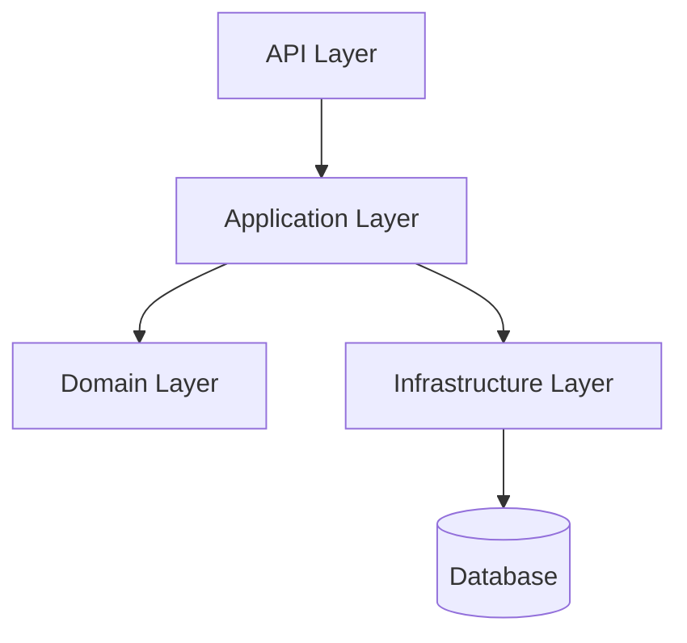

# Markdown Solution Documentation

## Purpose

This skill helps agents plan, write, organize, and **keep current** Markdown-based documentation for .NET solutions. It covers the core documentation structure—from the root `README.md` down to how-to guide pages, changelogs, and contribution guides—so that the output is useful both as standalone repository documentation and as a rendered site on GitBook, DocFX, GitHub Pages, or compatible platforms. Architecture and API documentation sections are **optional**: the agent must ask the user whether each is needed before generating them. Documentation is treated as a living artifact: it must be updated as part of every task that introduces or changes a feature.

## When to Use

- Creating or restructuring a `docs/` folder for a .NET solution
- Writing or improving the root `README.md` and per-project `README.md` files
- Building a GitBook-compatible documentation site (`SUMMARY.md`, chapter pages)
- Writing how-to guides and topic pages placed directly in the docs root
- Writing a `CHANGELOG.md` following Keep a Changelog conventions
- Adding `CONTRIBUTING.md`, `CODE_OF_CONDUCT.md`, or `SECURITY.md`
- Writing architecture documentation or ADRs **when the user explicitly requests them**
- Producing an API overview **when the user confirms it is needed** and the target platform supports it
- **Updating guide pages, README files, and the CHANGELOG when an existing feature changes**
- **Adding new topic pages or extending existing ones when a new feature is introduced**

## When Not to Use

- Writing XML documentation comments inside C# source code (use the **xml-comments-doc** skill instead)
- Configuring DocFX or MkDocs pipelines and build tooling
- Writing prose content for non-.NET or non-developer audiences without a solution context
- Generating API reference pages from XML comments (use DocFX or similar tooling for that)

## Inputs

| Input | Required | Description |
|-------|----------|-------------|
| Solution name and purpose | Yes | The name of the .NET solution and what it does |
| Project list | Yes | The projects or libraries in the solution and their roles |
| Target platform | No | GitBook, DocFX, GitHub Pages, or other — affects structure and front matter |
| Audience | No | Library consumers, internal developers, or end users |
| Existing docs | No | Any current documentation to review, improve, or restructure |
| Include architecture docs | No | Whether to generate an `architecture/` section — **must be confirmed with the user** |
| Include API docs | No | Whether to generate an `api/` section — **must be confirmed with the user** |
| Nature of change | No | For update tasks: whether the task adds a new feature, changes an existing one, or removes/deprecates one |
| Changelog history | No | Version history or release notes to incorporate |

## Workflow

### Step 1: Understand the solution and its documentation goals

Before writing, clarify:

- What the solution does and who its primary audience is
- Whether the documentation will be published on a platform (GitBook, GitHub Pages) or consumed directly in the repository
- Which parts of the documentation already exist and what needs to be created or improved
- Whether the solution is a library (needs API reference guidance), an application (needs operational docs), or a framework (needs both)

### Step 2: Ask about optional sections

Before generating any documentation, explicitly ask the user:

1. **Architecture documentation**: "Do you want an `architecture/` section with an overview page and support for Architecture Decision Records (ADRs)?" — Do **not** generate `architecture/` unless the user confirms.
2. **API documentation**: "Do you want an `api/` section with per-library overview pages?" — Explain that this section can be large and depends on the target platform. Do **not** generate `api/` unless the user confirms.

If the user's original request already provides a clear answer to either question (e.g., "create an architecture overview"), treat that as confirmation and skip asking.

### Step 3: Define the documentation structure

Use this baseline structure for a .NET solution:

```text
docs/
  README.md              # Introduction and navigation entry point
  SUMMARY.md             # GitBook table of contents (if using GitBook)
  getting-started.md     # Quick-start guide
  <topic>.md             # Simple topic page (one page is enough)
  <complex-topic>/       # Subfolder for topics that span multiple pages
    README.md            # Overview / entry point for the topic
    <subtopic>.md        # Individual sub-pages
  changelog.md           # Or CHANGELOG.md at repository root
  contributing.md        # Or CONTRIBUTING.md at repository root
  architecture/          # ONLY if confirmed by the user
    overview.md          # High-level architecture diagram and description
    decisions/           # Architecture Decision Records (ADRs)
      adr-0001-*.md
  api/                   # ONLY if confirmed by the user — always placed last
    overview.md          # API surface description and usage patterns
    <project-name>.md    # Per-library API overview (one file per main library)
```

Key layout rules:
- **Simple topics** (single-page coverage) are placed as individual `.md` files **directly at the `docs/` root**. Name them by subject (e.g., `authentication.md`, `configuration.md`).
- **Complex topics** (multiple related pages) get their own **subfolder directly under `docs/`**, named after the topic (e.g., `multi-tenancy/`, `payments/`). Each such subfolder must contain a `README.md` that serves as the entry point and links to all sub-pages within it.
- **`architecture/`** is included only when the user has confirmed it is needed (Step 2).
- **`api/`** is included only when the user has confirmed it is needed (Step 2). When present, it is always placed **at the end** of the docs folder, after all other sections.

Adapt the structure based on the platform:

- **GitBook**: Requires `SUMMARY.md` at the docs root with a hierarchical table of contents. Every page linked in `SUMMARY.md` must exist. Use relative links between pages.
- **DocFX**: Requires `toc.yml` files in each folder and a `docfx.json` configuration. Front matter (`uid:`, `title:`) should follow DocFX conventions.
- **GitHub Pages / plain Markdown**: No special structure required; ensure all internal links use relative paths and resolve correctly from the repository root.

### Step 4: Write the root README.md

The root `README.md` is the entry point for all audiences. It must include:

1. **Project name and one-line description** (heading + tagline)
2. **Badges** (build status, NuGet version, license, coverage — as applicable)
3. **Overview**: Two to four sentences explaining what the solution is, what problem it solves, and who it is for
4. **Features** (bullet list of key capabilities)
5. **Packages** — see rules below
6. **Quick start**: The minimal code snippet or command to get something working
7. **Installation**: NuGet package names and `dotnet add package` commands, or clone instructions
8. **Documentation link**: Point to the `docs/` folder or hosted site
9. **License** and **contributing** links

Keep the root `README.md` concise. Move detailed content into topic pages at the `docs/` root.

#### Packages section rules

**Up to 3 packages** — list them inline in the **Installation** section with `dotnet add package` commands and a single NuGet version badge per package. Do not create a separate Packages section.

**More than 3 packages** — create a dedicated **## Packages** section before the Installation section. For each package:

- Give the package name as a sub-heading or bold label
- Write a one-sentence description of what it does and who should reference it
- Render a NuGet version badge that links to the package's NuGet.org page, using the Shields.io NuGet badge format:

  ```markdown
  [](https://www.nuget.org/packages/My.Package.Name)
  ```

- If an `architecture/` section exists and there is a page that describes this package's design, add a link to it immediately after the badge.

Example Packages section for a solution with four packages:

````markdown
## Packages

| Package | Version | Description |
|---------|---------|-------------|
| `Deveel.Payments` | [](https://www.nuget.org/packages/Deveel.Payments) | Core payment processing abstractions and domain model. |
| `Deveel.Payments.EntityFramework` | [](https://www.nuget.org/packages/Deveel.Payments.EntityFramework) | EF Core persistence for the payments domain. [Architecture](docs/architecture/payments-ef.md) |
| `Deveel.Payments.AspNetCore` | [](https://www.nuget.org/packages/Deveel.Payments.AspNetCore) | ASP.NET Core middleware and endpoint extensions. |
| `Deveel.Payments.Stripe` | [](https://www.nuget.org/packages/Deveel.Payments.Stripe) | Stripe gateway integration for the payments pipeline. |
````

Rules for the Packages section:

- Use a Markdown table with columns: **Package**, **Version**, **Description**.
- The **Version** column contains only the NuGet badge; do not repeat the package name as a link.
- The badge URL pattern is always `https://img.shields.io/nuget/v/<PackageId>.svg` linking to `https://www.nuget.org/packages/<PackageId>`.
- If an architecture page for the package exists, append ` [Architecture](<relative-path>)` inline after the description, inside the Description cell.
- Keep descriptions to one sentence; deeper documentation belongs in guide pages or per-project READMEs.
- When the package list changes (package added, renamed, or removed), update this section as part of the same task (Step 12).

### Step 5: Write per-project README files (if applicable)

For multi-project solutions, each significant project or library should have its own `README.md` that covers:

- What the project does and how it fits into the solution
- Its public API surface at a high level (not a full API reference — that comes from XML comments)
- Dependency on other projects in the solution
- Example usage relevant to this project specifically

### Step 6: Write how-to guide pages

Apply the following placement rule based on topic complexity:

**Single-page topic** — place a single `.md` file directly at the `docs/` root:

```text
docs/
  authentication.md
  configuration.md
  error-handling.md
```

**Multi-page topic** — create a dedicated subfolder directly under `docs/`, named after the topic. The subfolder must contain a `README.md` that introduces the topic and links to every sub-page within it:

```text
docs/
  multi-tenancy/
    README.md          # Introduction and links to sub-pages
    configuration.md
    data-isolation.md
    tenant-resolution.md
  payments/
    README.md
    getting-started.md
    webhooks.md
    error-handling.md
```

Decision criteria — use a subfolder when **any** of the following is true:
- The topic requires more than one page to cover completely
- The topic has distinct subtopics that readers navigate independently
- The topic is complex enough that a flat page would exceed ~400 lines

Each guide page (whether flat or inside a subfolder) should:

1. State what the reader will accomplish in a single sentence
2. List prerequisites (packages, configuration, or concepts to know first)
3. Walk through the scenario step by step with code examples
4. End with a pointer to related pages or the API docs (if present)

Each subfolder `README.md` should additionally:

- Summarize the topic in one paragraph
- Link to every sub-page with a one-line description of each

### Step 7: Write the architecture section (only if confirmed in Step 2)

`docs/architecture/overview.md` should cover:

- The major layers or components and their responsibilities
- How components interact (data flow, dependency direction)
- Key technology and framework choices with brief rationale
- A textual or Mermaid diagram of the solution structure

Use Mermaid diagrams (` ```mermaid `) for architecture diagrams since they render natively on GitHub, GitBook, and DocFX with the right plugins.

Example Mermaid component diagram:

````markdown

````

#### Architecture Decision Records (ADRs)

Use the lightweight ADR format for significant design decisions:

```markdown
# ADR-NNNN: <Short Title>

## Status
Accepted | Proposed | Superseded by ADR-XXXX

## Context
<What situation or problem motivated this decision?>

## Decision
<What was decided and why?>

## Consequences
<What are the implications — positive and negative — of this decision?>
```

Number ADRs sequentially (`adr-0001-use-kista.md`). ADRs are never deleted; superseded ones are marked with a status update.

### Step 8: Write the API section (only if confirmed in Step 2)

The `api/` folder is **always placed at the end** of the `docs/` folder, after all other sections. Its scope and depth depend on the target platform:

- **GitBook / GitHub Pages**: Write narrative overview pages per library — describe the main types, entry points, and common usage patterns. Keep pages focused; do not replicate every method signature.
- **DocFX**: API reference pages are typically auto-generated from XML comments. Use the `api/` folder only for hand-written conceptual overview pages that DocFX cannot generate automatically.

Each page should:

1. Describe the library's public surface in one paragraph
2. Show the most important types and how they are typically composed
3. Link to the getting-started guide and relevant how-to pages

### Step 9: Write the CHANGELOG

Follow [Keep a Changelog](https://keepachangelog.com) conventions:

```markdown
# Changelog

All notable changes to this project will be documented in this file.

## [Unreleased]

## [X.Y.Z] - YYYY-MM-DD
### Added
### Changed
### Deprecated
### Removed
### Fixed
### Security
```

Place `CHANGELOG.md` at the repository root. For multi-package solutions, keep one changelog per independently versioned package.

### Step 10: Write the getting-started guide

`docs/getting-started.md` must be runnable from start to a visible result:

1. Prerequisites (SDK version, tools, environment)
2. Installation or project setup steps
3. Minimal working example with expected output
4. Pointer to the next how-to page or API docs (if present)

### Step 11: Write the GitBook SUMMARY.md (if targeting GitBook)

`SUMMARY.md` is the authoritative table of contents for GitBook. Every page that should appear in navigation must be listed. Place topic pages and topic subfolders before `architecture/` and `api/`; those optional sections always come last:

```markdown
# Summary

* [Introduction](README.md)
* [Getting Started](getting-started.md)
* [Authentication](authentication.md)
* [Multi-Tenancy](multi-tenancy/README.md)
  * [Configuration](multi-tenancy/configuration.md)
  * [Data Isolation](multi-tenancy/data-isolation.md)
  * [Tenant Resolution](multi-tenancy/tenant-resolution.md)
* [Changelog](changelog.md)
* [Contributing](contributing.md)
* [Architecture](architecture/overview.md)
  * [ADR-0001 Use Kista](architecture/decisions/adr-0001-use-kista.md)
* [API Overview](api/overview.md)
  * [Payments Library](api/payments.md)
```

Rules for `SUMMARY.md`:
- Use relative paths from the docs root
- Indent child pages with two spaces
- Every listed file must exist; broken links cause GitBook to fail
- Do not nest more than three levels deep
- Single-page topics appear as flat entries; multi-page topic subfolders appear as a parent entry pointing to the subfolder `README.md`, with sub-pages indented beneath
- `architecture/` and `api/` are listed only when the user has confirmed they are needed
- `api/` always appears after `architecture/` when both are present

### Step 12: Keep documentation in sync with code changes

Documentation must be updated **as part of the same task** that introduces or modifies a feature — never deferred to a follow-up task. Apply this step whenever the work involves a code change rather than writing docs from scratch.

#### Identify affected documentation

Before writing or modifying any doc page, scan the existing `docs/` folder and identify:

- Every guide page or subfolder that describes, references, or provides examples for the changed or new feature
- Whether the root `README.md` features list needs to be updated (significant new or removed capability)
- Whether the getting-started guide uses the changed feature in its example

#### For a changed feature

1. Update every affected guide page: correct instructions, code examples, configuration snippets, and any behavior description that is no longer accurate.
2. If the change is breaking or alters observable behavior, add a short callout or note near the top of the affected page.
3. Add a `### Changed` entry under `[Unreleased]` in `CHANGELOG.md`.

#### For a new feature

1. Decide where it belongs using the single-page vs. multi-page rule from Step 6:
   - Simple feature → new flat `.md` file at the `docs/` root, or a new section appended to an existing closely related page.
   - Complex feature with multiple subtopics → new topic subfolder under `docs/` with a `README.md` entry point.
2. Write the new page(s) following the guide-page format.
3. Add the new page or subfolder to `SUMMARY.md` (if using GitBook) in the correct position — before `architecture/` and `api/`.
4. Update the root `README.md` features list if the new feature is significant enough to appear there.
5. Add a `### Added` entry under `[Unreleased]` in `CHANGELOG.md`.

#### For a deprecated or removed feature

1. If deprecated: mark the relevant guide content with a deprecation notice and link to the replacement feature's documentation.
2. If removed: delete or archive the guide page(s), remove the entries from `SUMMARY.md`, and update any cross-links from other pages that pointed to the removed content.
3. Add a `### Deprecated` or `### Removed` entry under `[Unreleased]` in `CHANGELOG.md`.

#### Rules

- A code change and its documentation update must land in the same commit or pull request.
- If no `docs/` folder exists yet when a feature change is requested, create it following the baseline structure from Step 3 before documenting the feature.
- When adding a new page, always verify the `SUMMARY.md` is updated so the page is reachable in navigation.

### Step 13: Validate cross-links and structure

Before finishing:

- Verify all internal Markdown links resolve to existing files using relative paths
- Confirm `SUMMARY.md` (if present) lists every page that should be navigable, including any newly added pages
- Check that no page is orphaned (exists in the folder but not linked from any navigation or parent page)
- Confirm that simple single-page topics are flat files at the `docs/` root
- Confirm that every multi-page topic has a dedicated subfolder with a `README.md` entry point
- Confirm there is no generic `guides/` subfolder — topic subfolders are named after their subject
- Confirm that `api/` (if present) is the last section in both the folder and in `SUMMARY.md`
- Confirm that `architecture/` (if present) was explicitly requested by the user
- Confirm that every code change in this task has a corresponding doc update and a `CHANGELOG.md` entry
- Validate Mermaid diagrams render correctly by checking syntax
- Ensure heading hierarchy is consistent (one `#` per page, `##` for sections, `###` for subsections)

## Validation

- [ ] Root `README.md` exists and covers name, overview, quick start, installation, and links
- [ ] Solutions with more than 3 packages have a dedicated **## Packages** section with NuGet badges and one-sentence descriptions
- [ ] Solutions with 3 or fewer packages list them inline in the Installation section without a separate Packages section
- [ ] NuGet badges use the Shields.io format and link to the correct NuGet.org package page
- [ ] If architecture pages exist for individual packages, the Packages table links to them
- [ ] `docs/` folder is present and follows the agreed structure
- [ ] `SUMMARY.md` exists and lists all navigable pages (GitBook targets only)
- [ ] Simple single-page topics are placed as flat `.md` files at the `docs/` root
- [ ] Complex multi-page topics have a dedicated subfolder under `docs/` named after the topic
- [ ] Every topic subfolder contains a `README.md` that introduces the topic and links to its sub-pages
- [ ] There is no generic `guides/` subfolder — subfolders are named by topic
- [ ] The user was asked before generating `architecture/` — the folder exists only if confirmed
- [ ] The user was asked before generating `api/` — the folder exists only if confirmed
- [ ] When `api/` is present, it appears at the end of the docs folder and after `architecture/`
- [ ] All internal Markdown links use relative paths and resolve to existing files
- [ ] ADRs (if present) are numbered sequentially and use the standard status/context/decision/consequences format
- [ ] `CHANGELOG.md` follows Keep a Changelog conventions
- [ ] Every feature change or addition in this task has a corresponding doc update
- [ ] Every feature change or addition in this task has a `CHANGELOG.md` entry under `[Unreleased]`
- [ ] Newly added pages are listed in `SUMMARY.md` and are reachable from navigation
- [ ] Removed or deprecated features have their documentation marked or removed accordingly
- [ ] No page is orphaned (all files are reachable from the navigation structure)
- [ ] Mermaid diagrams use valid syntax
- [ ] Heading hierarchy is consistent throughout all pages (single `#` title per page)
- [ ] Per-project `README.md` files exist for significant libraries or applications
- [ ] Platform-specific requirements (DocFX `toc.yml`, GitBook `SUMMARY.md`) are met

## Common Pitfalls

| Pitfall | Solution |
|---------|----------|
| Root `README.md` is too long and mixes guide content | Move detailed content into topic pages or topic subfolders at the `docs/` root; keep the root README as an entry point |
| More than 3 packages but no dedicated Packages section | Create a `## Packages` table with NuGet badges and one-sentence descriptions when the solution has more than 3 packages |
| NuGet badge URL uses the wrong format or links to a search page | Use `https://img.shields.io/nuget/v/<PackageId>.svg` linking to `https://www.nuget.org/packages/<PackageId>` |
| Package descriptions in the Packages table are more than one sentence | Keep each description to one sentence; deeper content belongs in per-project READMEs or guide pages |
| Architecture link in Packages table missing when architecture page exists | When `architecture/` contains a page for a package, add `[Architecture](<relative-path>)` to that package's Description cell |
| Packages section created for 3 or fewer packages | Only create the section when there are more than 3 packages; otherwise list them inline in Installation |
| A complex topic with many pages is placed as a single flat file | Split it into a subfolder named after the topic, with a `README.md` entry point and one file per sub-page |
| A topic subfolder has no `README.md` | Every topic subfolder must have a `README.md` that introduces the topic and links to its sub-pages |
| A generic `guides/` subfolder is created | Name subfolders after their topic, not after a generic category; `guides/` adds no useful grouping |
| Architecture section is created without asking the user | Always confirm with the user before generating `architecture/` — it may not be needed |
| API section is created without asking the user | Always confirm with the user and the target platform before generating `api/` — it can be large and platform-specific |
| `api/` folder appears in the middle of the docs structure | Place `api/` last in the folder and last in `SUMMARY.md`, after all other sections |
| Feature changed but documentation not updated | Apply Step 12: scan all affected pages and update them as part of the same task |
| New feature added but no new or updated doc page was written | Every new feature must have at least one guide page; apply the single-page vs. subfolder rule |
| Feature removed but old guide pages remain | Delete or archive orphaned pages and remove them from `SUMMARY.md` |
| CHANGELOG not updated after a feature change | Every Added, Changed, Deprecated, or Removed item must have a `CHANGELOG.md` entry under `[Unreleased]` |
| New page added but not listed in `SUMMARY.md` | Always update `SUMMARY.md` when adding a new page; orphaned pages are not navigable on GitBook |
| Documentation update is deferred to a later task | Docs and code changes must land together — deferring produces stale documentation |
| GitBook `SUMMARY.md` references files that don't exist | Create all listed files before publishing; GitBook fails on missing links |
| Topic subfolder `README.md` is missing from `SUMMARY.md` | Use the subfolder `README.md` as the parent entry; list sub-pages indented beneath it |
| Internal links use absolute paths or GitHub UI URLs | Always use relative paths: `../multi-tenancy/configuration.md` not full GitHub URLs |
| ADRs are updated in-place after acceptance | Add a new ADR and mark the old one as superseded; never rewrite history |
| Architecture diagram is a static image instead of Mermaid | Use Mermaid so diagrams stay in sync with code and render on all platforms |
| CHANGELOG entries are added to old versions instead of `[Unreleased]` | Always add new changes under `[Unreleased]` and promote on release |
| DocFX pages lack `uid:` front matter | Add `uid:` and `title:` front matter to every DocFX page for xref support |
| Per-project READMEs duplicate the root README | Focus per-project docs on what is unique to that project; link to the root for shared content |
| Pages exist in `docs/` but are not linked from `SUMMARY.md` | Treat the navigation file as the source of truth; prune or link orphaned files |
| Mermaid diagram uses unsupported features for the target platform | Test diagrams on the target rendering environment (GitBook, GitHub, DocFX) before committing |


